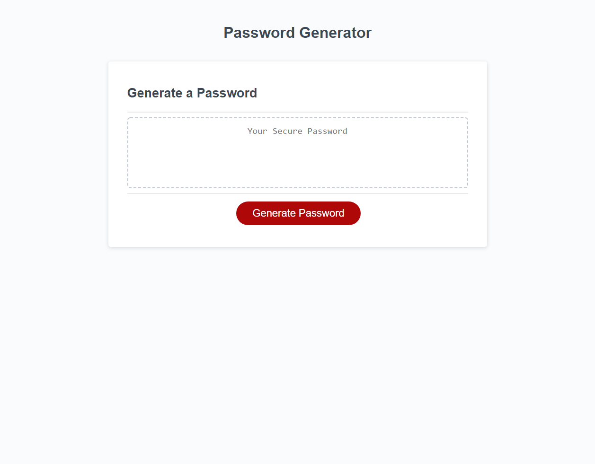

# Password Generator

## Description
A small website project that takes in user inputs to generate a random password based on the settings.

## Table of Contents
- [Description](#description)
- [Portfolio Website Preview](#password-generator-website-preview)
- [JavaScript](#javascript)
- [Hurdles and Pitfalls](#hurdles-and-pitfalls)
- [Conclusion](#conclusion)

## Password Generator Website Preview

Click to Reveal

Click the preview to be redirected to the website!

## JavaScript

This project was a exercise to get familiar with JavaScript and working with object oriented programming languages again after spending most of my time recently working with HTML and CSS. The logic for the script consisted of asking for user input, randomly generating character to add onto a string to return as a password, and looping through user inputs until they provided what was asked for (to cleanse user inputs). Ultimately this was a pretty straight forward project with generating a random number being the most difficult line. I found that having a pseudocode foundation was important to plan out how my code was going to function and keeping me organized.

## Hurdles and Pitfalls

The one thing that really bothered me about this program is the tools we were given were rather limited. This caused minior user flow and input problems. For example once you start generating a password, to set the settings is a rather long set of dialogue boxes that you have to go through. Ideally you have a slider that allows the user to choose how long they want it and you can prevent them from providing anything other than a number. However we can only use the prompt function which takes in a string, making the cleansing process long and annoying. When the user clicks cancel, prompt returns the number 0 which is a number not a boolean so there was no way to stop the loop early.

## Conclusion

Ultimately this exercise was a good way to settle into coding with JavaScript. Most of my experience has been in Java and Python so this activity allowed me to really get used to the new syntax and improve both my writing and reading of this new language.